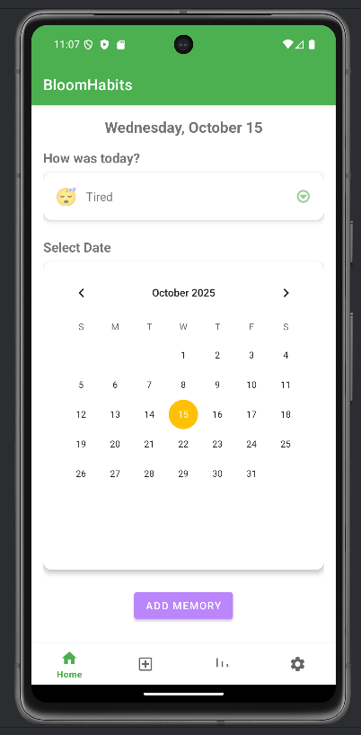
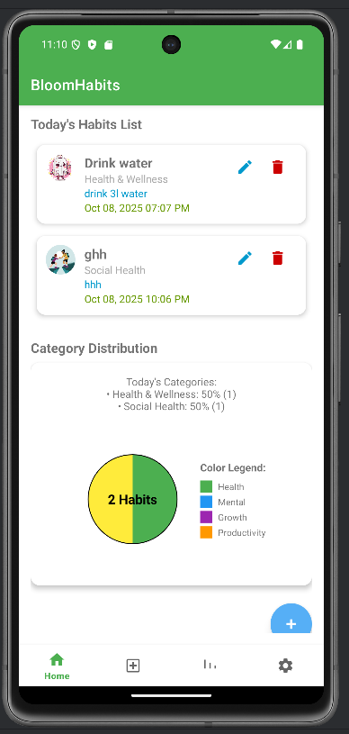
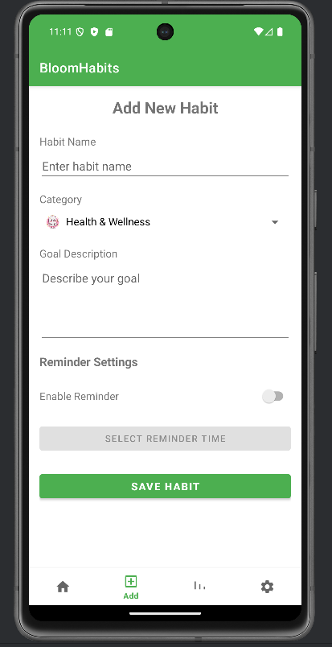
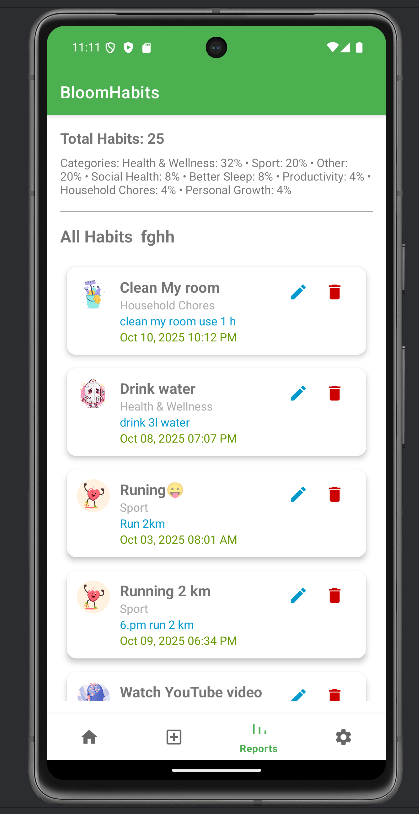
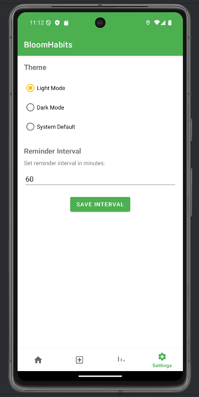
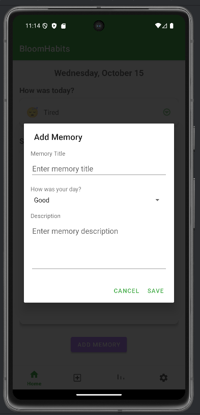
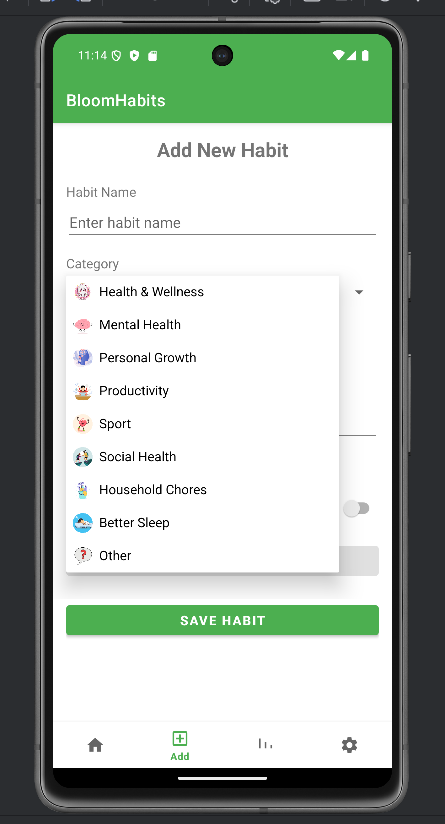
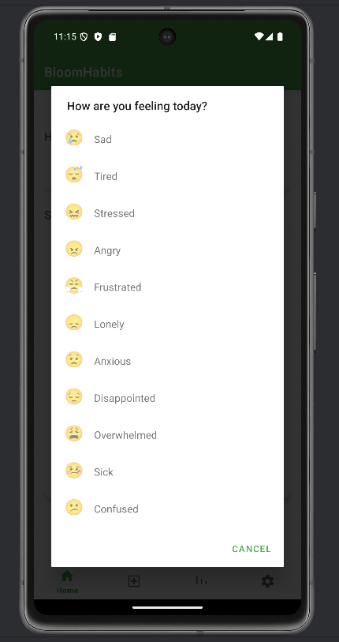

> 📘 **Academic Notice**  
> **This mobile application was developed as part of the _Mobile Application Development_ module – _Self Assignment 3_.**

# 📱 Bloom Habits – Kotlin Daily Habit Tracker

Bloom Habits is a **native Android wellness application** built with **Kotlin**, designed to help users build healthy habits, track daily progress, and stay mindful through mood logging and smart reminders.

The app focuses on simplicity, offline usability, and a distraction-free experience while retaining user preferences seamlessly across sessions.

---

## ✨ What Makes Bloom Habits Different?

Instead of focusing on a single habit, **Bloom Habits combines habit tracking, emotional well-being, and hydration reminders** into one lightweight and user-friendly application.

✔ Offline-friendly  
✔ Minimal & clean UI  
✔ Persistent user preferences  
✔ Designed for daily wellness  

---

## 🌱 Core Features

### 🗓️ Daily Habit Tracker
- Add, edit, and delete daily wellness habits  
  *(e.g., drink water, meditate, steps)*
- Visual daily completion progress
- Habit-based reminders with alarms

### 😊 Mood Journal with Emoji Selector
- Log moods using emojis
- Automatically stores date & time
- View mood history in:
  - List view  
  - Calendar-style view

### 💧 Hydration Reminder
- Smart water reminders
- Uses:
  - Notifications
  - AlarmManager / WorkManager
- Custom reminder intervals

---

## 🌗 Advanced Features
- Dark Mode & Light Mode support
- Alarm system for habits and reminders
- Lightweight storage using SharedPreferences
- Smooth state retention across app restarts

---

## 🧩 App Architecture
- **Activities & Fragments** for modular UI
  - Habits
  - Mood Journal
  - Settings
- **SharedPreferences** for local data persistence
- **Explicit & Implicit Intents**
  - Navigation
  - Sharing mood summaries
- Responsive UI
  - Phones & tablets
  - Portrait & landscape modes

---

## 🛠 Tech Stack
| Category | Technology |
|-------|-----------|
| Language | Kotlin |
| IDE | Android Studio |
| UI | XML + Material Design |
| Persistence | SharedPreferences |
| Background Tasks | AlarmManager / WorkManager |
| Notifications | Android Notification System |

---

## 📸 Screenshots

  
  
  
  

  
  
  
  

  

